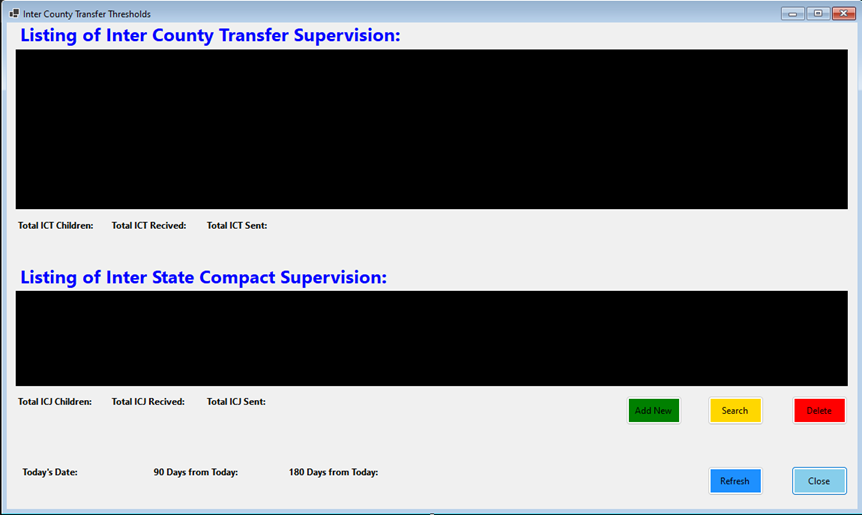
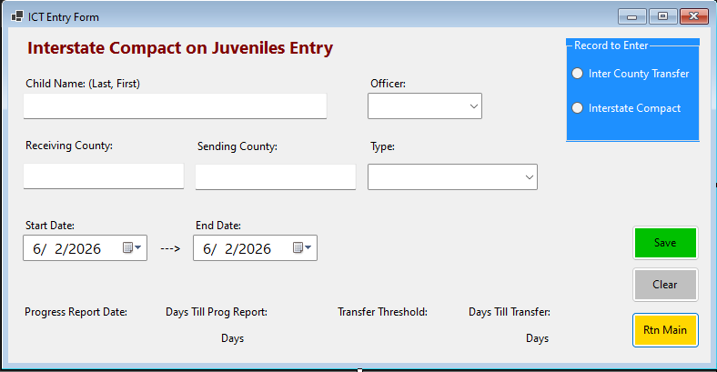
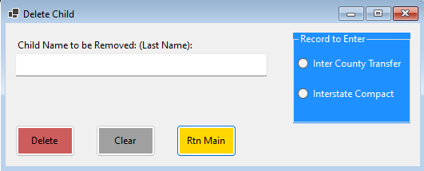

# Inter Co Transfer Thresholds Tracker

This repository contains vb scripts to track inter company transfer thresholds for various counties. The script is designed 
to monitor and report on the transfer thresholds, ensuring compliance with progress reports and thresholds.  

### Features:

1.) **Adding/Deleting Clients**: The script allows users to easily add or delete clients from the tracking system.

2.) **Searching**: Users can search for specific clients or transfer records to quickly access relevant information.

3.) **Preview with Update**: The main form provides a preview of the current transfer thresholds with updated timeframes.

v1.0.0 - Initial release with basic functionalities for adding, deleting, and searching clients, as well as previewing transfer threshold.
v1.1.0 - Added functionality to to update transfer thresholds preview on load.
v2.0.0 - Added the ability to create and work with Interstate Compact on Juveniles.
v2.1.0 - Extended ability to work with Interstate Ccmpact on Juveniles to include the ability to delete and search.
